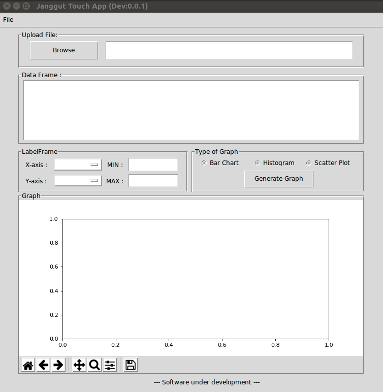
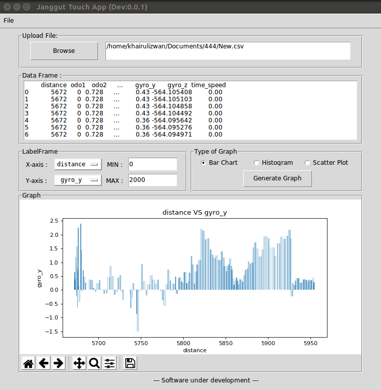

# Plotting App

## Tools/Library
1.  Python 2.x
2.  Tkinter
3.  Pandas
4.  Matplotlib

## Code
## reference code:
1.  gui.py
2.  gui2.py
3.  gui3.py
4.  optMenu.py
5.  readData.py
6.  tkinterFileDialog.py
7.  updateGraph.py

## Developed code and apps (still under development and testing)
8.  devApp.py

